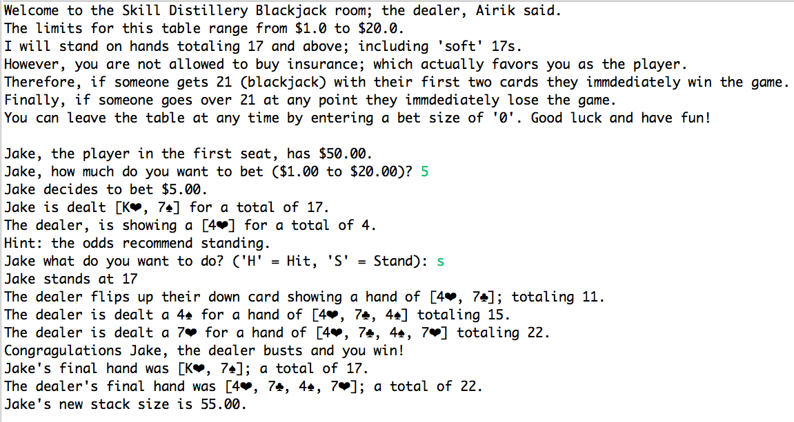

# Blackjack Poker

### Created by Jason Caldwell
##### October 2017

## Program Overview
A Blackjack poker game. The person closest to 21 without going over wins!

A player is given a random stack size for their session. Each hand (round) consists of:
* The deck getting shuffled.
* The player deciding how much they want to bet within the table limits.
* The player is dealt 2 cards face up and the dealer is dealt 1 card face up and another 1 face down.
* If either person has 21 they win and the hand is over.
* Otherwise, a hint is displayed based off of the player's hand total and the dealer's known card.
* The player choses to hit (get more cards) or stand.
* If the player busts (goes over 21) the dealer wins.
* Otherwise, once the player stands the dealer has to hit until they have a total of 17 or more.
* If the dealer busts the player wins.
* Otherwise, the point values of the two hands are compared and the person with the higher hand value wins. A push (tie) is also possible.

### Sample Hand

### Installation
* Developed in Java.

## Programming Principles
* Variables / Fields
* Conditions / Decisions
* Methods / Functions
* Loops (for each, for, do while, and while)
* Classes / Objects

### Testing Concepts
* Test Driven Development (TDD)
* 27 test cases in their own package

### Design Overview
* 7 Classes
* 2 Enums
* 4 Test Case Classes

### Licensing
See the file called LICENSE.
